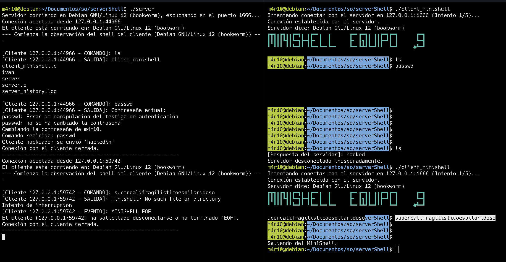
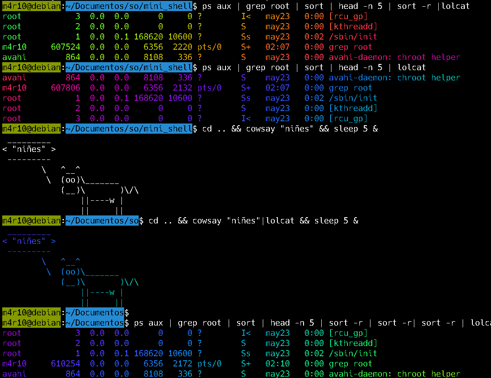

# MiniShell
Este proyecto fue desarrollado como parte de mi curso de Sistemas Operativos, con el objetivo principal de explorar y comprender el manejo de procesos y tuberías (pipes) a un nivel fundamental. Más allá de una simple emulación de terminal, este trabajo profundiza en la interacción entre procesos y la comunicación interproceso, utilizando execvp en lugar de invocar una terminal externa.
Características Principales

Este repositorio contiene varias iteraciones del proyecto MiniShell, cada una con un enfoque específico, culminando en una arquitectura cliente-servidor para la observación de la actividad del shell.

    MiniS: La versión reducida y básica del shell. Ideal para comprender los fundamentos de la ejecución de comandos.
    newMiniS: La versión completa del shell, incorporando funcionalidades adicionales para una experiencia más robusta.
    newerMiniS: Una variación de newMiniS que excluye el manejo de procesos en segundo plano, simplificando el flujo de ejecución para ciertos escenarios.
    servidor/: El corazón de la funcionalidad de cliente-servidor. Esta arquitectura permite una observación remota y detallada de las acciones realizadas en el minishell.



#### Arquitectura Cliente-Servidor (Observador)

Una de las características más destacadas de este proyecto es su implementación cliente-servidor:

    Cliente (Simulador de Terminal): Actúa como la interfaz de usuario, donde los comandos son ingresados y ejecutados. Simula el comportamiento de una terminal real.
    Servidor (El Observador "Chismoso"): Opera en segundo plano, recibiendo y registrando en tiempo real cada comando ejecutado y su respectiva salida por parte del cliente. Además, implementa lógicas de seguridad y monitoreo:
        Detección de comandos sensibles: Si el cliente intenta ejecutar el comando passwd, el servidor lo detecta inmediatamente y envía un mensaje de "¡HAS SIDO HACKEADO!" al cliente, cerrando la conexión como medida de seguridad.
        "Palabra Mágica" de Interrupción: Si el cliente ingresa la palabra supercalifragilisticoespilaridoso, el servidor responde con el mensaje "No es posible interrumpir con CTRL+C.", demostrando la capacidad de interceptar y modificar el flujo normal de ejecución.



#### Compilación

```Bash
gcc -o minis MiniS.c
gcc -o newminis newMiniS.c -lreadline -lhistory
gcc -o newerminis newerMiniS.c -lreadline -lhistory
```

```Bash
gcc -o server server.c
gcc client_minishell.c  -o client_minishell.c  -lreadline -lhistory
```

